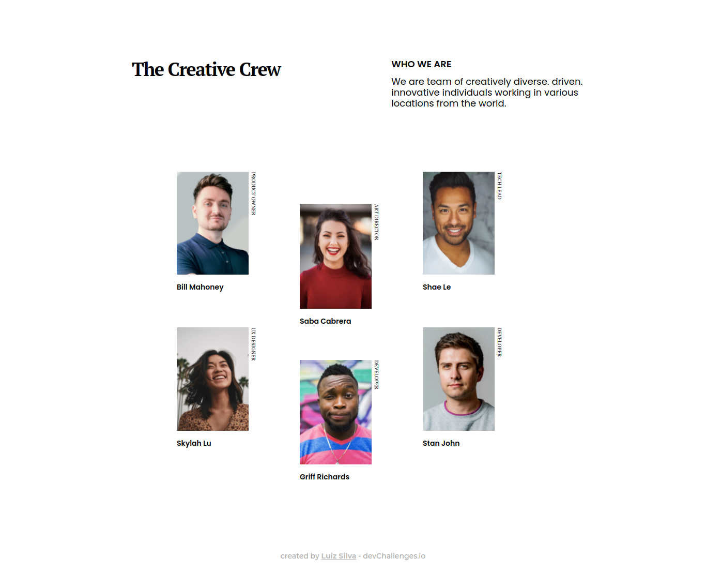

<h1 align="center">The Creative Crew</h1>

   Solution for a challenge from  <a href="http://devchallenges.io" target="_blank">Devchallenges.io</a>.

  <h3>
    <a href="https://{your-demo-link.your-domain}">
      Demo
    </a>
     | 
    <a href="https://github.com/lu1zf/my-team-page-challenge">
      Solution
    </a>
     | 
    <a href="https://devchallenges.io/challenges/hhmesazsqgKXrTkYkt0U">
      Challenge
    </a>
  </h3>

<!-- TABLE OF CONTENTS -->

## Table of Contents

- [Overview](#overview)
  - [Built With](#built-with)
- [Features](#features)
- [Contact](#contact)

<!-- OVERVIEW -->

## Overview

You can check the live demo [here](https://my-team-lu1zf.netlify.app/). The development of this project helped me consolidate knowledge about responsive design, mobile first and flexbox.

### Built With

- HTML
- CSS

## Features

- Responsive web design
- Mobile first

## Contact

- Website [luizsilva.dev.br](https://www.luizsilva.dev.br)
- GitHub [@lu1zf](https://github.com/lu1zf)
- Linkedin [Luiz Silva](https://www.linkedin.com/in/lu1zf/)
